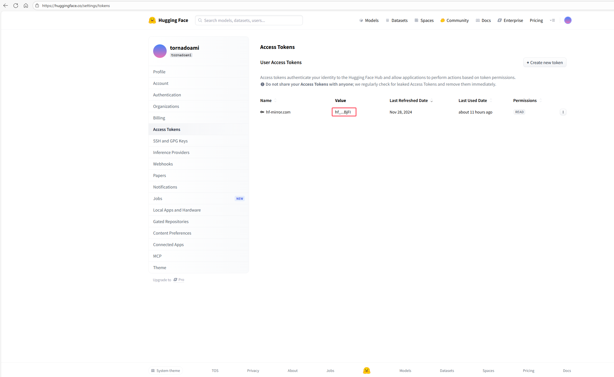

# Hugging Face 模型下载脚本

这个项目提供了多个脚本来下载 Hugging Face 上的大模型文件，具有自动重试机制和错误恢复功能。

## 📁 文件说明

- `download_hf_model.sh` - 完整功能的 Linux/macOS shell 脚本
- `download_hf_model_simple.sh` - 简化版 Linux/macOS shell 脚本  
- `download_hf_model.bat` - Windows 批处理文件版本
- `configure_mirror.sh` - 镜像站点配置脚本（中国大陆用户推荐）
- `README.md` - 使用说明文档

## 🚀 快速开始

### 1. 安装依赖

首先需要安装 Hugging Face Hub CLI 工具（建议先使用uv创建虚拟环境，然后再安装）：

```bash
#uv的使用说明可以参考此文：https://docs.dingtalk.com/i/nodes/3NwLYZXWynR79aRKivkKpMZXVkyEqBQm?corpId=
pip install -U "huggingface_hub[cli]"
```

### 2. 配置镜像站点（中国大陆用户推荐）

为了提高下载速度，建议配置镜像站点：

```bash
chmod +x configure_mirror.sh
./configure_mirror.sh
```

### 3. 测试下载功能（可选）

运行测试脚本验证环境配置：

```bash
chmod +x test_download.sh
./test_download.sh
```

### 2. 身份验证（可选）

对于大多数模型，身份验证是可选的。但对于某些需要授权的大模型，必须先进行身份验证：


**身份验证方式：**

#### 方式一：交互式登录（推荐）
```bash
hf auth login
```
按照提示输入用户名和密码，或使用浏览器进行OAuth认证。

#### 方式二：环境变量认证
```bash
export HF_TOKEN="your_token_here"
```
或者
```bash
set HF_TOKEN=your_token_here  # Windows
```

**重要说明：**
- **授权模型**: 某些大模型（如 Llama 2、Code Llama、gemma系列大模型 等）需要用户接受使用条款才能下载
- **访问权限**: 需要在 Hugging Face 网站上申请访问权限，通常需要：
  1. 在模型页面点击 "Access Request" 按钮
  2. 填写申请表格，说明使用目的
  3. 等待审核通过（通常几分钟到几小时）
  4. 接受使用条款
- **常见需要授权的模型**:
  - `meta-llama/Llama-2-7b-chat-hf` - Meta 的 Llama 2 模型
  - `meta-llama/CodeLlama-7b-hf` - Meta 的代码生成模型
  - `microsoft/DialoGPT-large` - 微软的对话模型
  - 其他商业公司发布的大模型

**获取访问权限的步骤：**
1. 访问模型页面：https://huggingface.co/[model_name]
2. 点击 "Access Request" 或 "Request Access" 按钮
3. 填写申请信息（使用目的、研究/商业用途等）
4. 等待审核通过
5. 接受使用条款
6. 使用 `hf auth login` 登录后即可下载

**获取 HF_TOKEN：**
1. 访问 https://huggingface.co/settings/tokens
2. 点击 "New token"
3. 输入令牌名称和权限
4. 复制生成的令牌
5. 设置为环境变量：`export HF_TOKEN="hf_xxxxxxxxxxxxxxxxxxxxxxxxxxxxxxxx"`



### 3. 下载模型

#### Linux/macOS 用户

使用完整版脚本：
```bash
chmod +x download_hf_model.sh
./download_hf_model.sh meta-llama/Llama-2-7b-chat-hf
```

使用简化版脚本：
```bash
chmod +x download_hf_model_simple.sh
./download_hf_model_simple.sh microsoft/DialoGPT-medium
```

#### Windows 用户

```cmd
download_hf_model.bat meta-llama/Llama-2-7b-chat-hf
```

## 📖 详细用法

### 基本语法

```bash
# 完整版脚本
./download_hf_model.sh <model_name> [download_path] [max_retries]

# 简化版脚本
./download_hf_model_simple.sh <model_name>

# Windows 版本
download_hf_model.bat <model_name> [download_path] [max_retries]
```

### 参数说明

- `model_name`: 要下载的模型名称（必需）
- `download_path`: 下载路径（可选，默认：使用 `hf` 默认目录）
- `max_retries`: 最大重试次数（可选，默认：999）

### 使用示例

```bash
# 使用 hf 默认目录，使用默认重试次数
./download_hf_model.sh meta-llama/Llama-2-7b-chat-hf

# 指定下载目录和重试次数
./download_hf_model.sh meta-llama/Llama-2-7b-chat-hf ./my_models 10

# 下载到绝对路径
./download_hf_model.sh "microsoft/DialoGPT-medium" /data/models 3

# 使用简化版脚本
./download_hf_model_simple.sh "gpt2"
```

## ✨ 主要特性

### 🔄 自动重试机制
- 网络中断时自动重试
- 可配置重试次数和延迟时间
- 智能错误处理和恢复

### 📊 下载验证
- 自动检查下载完整性
- 验证重要文件是否存在
- 显示详细的下载统计信息

### 🎨 用户友好
- 彩色日志输出
- 进度显示和状态更新
- 详细的错误信息

### 🛡️ 错误处理
- 依赖检查
- 参数验证
- 优雅的错误退出
- **直接下载验证**: 不再预先验证模型是否存在，直接通过下载验证

### 🌏 镜像站点支持
- **自动检测**: 脚本会自动检测 `HF_ENDPOINT` 环境变量
- **中国大陆优化**: 推荐使用 `https://hf-mirror.com` 镜像站点
- **智能提醒**: 未配置镜像站点时会提供配置建议
- **一键配置**: 支持交互式配置镜像站点

## 🔧 高级配置

### 环境变量

可以通过环境变量自定义行为：

```bash
export HF_HUB_CACHE="/path/to/cache"  # 设置缓存目录
export HF_TOKEN="your_token_here"      # 设置访问令牌（用于身份验证）
export HF_ENDPOINT="https://hf-mirror.com"  # 设置镜像站点（中国大陆用户推荐）
```

**HF_TOKEN 环境变量说明：**
- **用途**: 用于身份验证，访问需要授权的模型
- **格式**: `hf_xxxxxxxxxxxxxxxxxxxxxxxxxxxxxxxx`
- **获取方式**: 在 https://huggingface.co/settings/tokens 创建
- **权限**: 建议选择 "read" 权限即可
- **安全性**: 请妥善保管，不要泄露给他人
- **Windows 设置**: `set HF_TOKEN=your_token_here`
- **Linux/macOS 设置**: `export HF_TOKEN="your_token_here"`

### 镜像站点配置（中国大陆用户）

为了提高下载速度，中国大陆用户建议配置镜像站点：

#### Linux/macOS 用户
```bash
# 临时配置（当前会话有效）
export HF_ENDPOINT=https://hf-mirror.com

# 永久配置（添加到 ~/.bashrc 或 ~/.zshrc）
echo 'export HF_ENDPOINT=https://hf-mirror.com' >> ~/.bashrc
source ~/.bashrc

# 或者使用以下命令快速配置
echo 'export HF_ENDPOINT=https://hf-mirror.com' >> ~/.bashrc && source ~/.bashrc
```

#### Windows 用户
```cmd
# 临时配置（当前会话有效）
set HF_ENDPOINT=https://hf-mirror.com

# 永久配置（使用 setx 命令，需要管理员权限）
setx HF_ENDPOINT "https://hf-mirror.com"

# 或者通过系统设置配置
# 1. 右键"此电脑" > 属性 > 高级系统设置 > 环境变量
# 2. 新建系统变量 HF_ENDPOINT，值设为 https://hf-mirror.com
```

### 自定义重试策略

编辑脚本中的配置变量：

```bash
DEFAULT_MAX_RETRIES=10        # 最大重试次数
DEFAULT_RETRY_DELAY=30        # 重试间隔（秒）
```

## 📋 支持的模型类型

脚本支持下载各种类型的 Hugging Face 模型：

- **文本生成模型**: GPT, LLaMA, BLOOM 等
- **多模态模型**: CLIP, DALL-E 等  
- **语音模型**: Whisper, SpeechT5 等
- **计算机视觉模型**: ViT, ResNet 等
- **自定义模型**: 任何上传到 Hugging Face Hub 的模型

## 🚨 注意事项

### 网络要求
- 稳定的网络连接
- 大模型下载可能需要数小时
- 建议使用有线网络或稳定的WiFi

### 存储空间
- 确保有足够的磁盘空间
- 大模型可能需要数GB到数十GB空间
- 建议使用SSD以提高下载速度

### 长时间运行
- 建议使用 `screen` 或 `tmux` 运行
- 避免在SSH会话中断时丢失进度
- 可以设置断点续传

### 模型验证
- **脚本不再预先验证模型是否存在**
- 直接通过 `hf download` 命令进行下载
- 如果模型不存在，下载命令会自动报错

### 授权模型访问
- **某些大模型需要特殊授权**才能下载
- 下载前请确保已在 Hugging Face 网站上申请并获得了访问权限
- 如果遇到 "Access denied" 错误，请检查：
  1. 是否已申请访问权限
  2. 是否已接受使用条款
  3. 是否已正确登录（`hf auth login`）
- 授权申请通常需要几分钟到几小时的处理时间

### 下载目录
- **默认行为**: 如果不指定下载路径，脚本会使用 `hf` 命令的默认目录
- **自定义路径**: 如果指定了下载路径，脚本会在该路径下创建目录并下载
- **hf 默认目录**: 通常是 `~/.cache/huggingface/hub/` 或环境变量 `HF_HUB_CACHE` 指定的目录

## 🐛 常见问题

### Q: 下载速度很慢怎么办？
A: 
- 检查网络连接质量
- 尝试使用VPN或代理
- 考虑在非高峰时段下载

### Q: 下载中断后如何恢复？
A: 
- 脚本支持断点续传
- 重新运行相同命令即可
- 已下载的文件不会重复下载

### Q: 出现权限错误怎么办？
A: 
- 确保脚本有执行权限：`chmod +x script.sh`
- 检查目标目录的写入权限
- 在Windows上以管理员身份运行

### Q: 如何下载特定版本？
A: 
- 在模型名称后添加版本标签
- 例如：`meta-llama/Llama-2-7b-chat-hf@v1.0.0`

### Q: 脚本会检查模型是否存在吗？
A: 
- **不会预先检查**，直接尝试下载
- 如果模型不存在，`hf download` 命令会自动报错
- 这样可以避免额外的API调用，提高效率

### Q: 如何配置镜像站点以提高下载速度？
A: 
- **Linux/macOS**: `export HF_ENDPOINT=https://hf-mirror.com`
- **Windows**: `set HF_ENDPOINT=https://hf-mirror.com`
- **永久配置**: 添加到系统环境变量或 shell 配置文件中
- **脚本自动检测**: 运行脚本时会自动检查并提供配置建议

### Q: 使用镜像站点会影响模型质量吗？
A: 
- **不会影响模型质量**，镜像站点只是提供更快的下载速度
- 所有模型文件都经过完整性校验
- 镜像站点与官方站点保持同步

### Q: 下载时提示 "Access denied" 怎么办？
A: 
- 该模型可能需要特殊授权，请先在 Hugging Face 网站上申请访问权限
- 访问模型页面，点击 "Access Request" 按钮
- 填写申请表格，说明使用目的（研究、学习、商业等）
- 等待审核通过后，接受使用条款
- 使用 `hf auth login` 登录后重新尝试下载
- 常见需要授权的模型：Llama 2、Code Llama、DialoGPT 等

### Q: 如何通过环境变量进行身份验证？
A: 
- 创建 HF_TOKEN：访问 https://huggingface.co/settings/tokens
- 设置环境变量：
  - **Linux/macOS**: `export HF_TOKEN="hf_xxxxxxxxxxxxxxxxxxxxxxxxxxxxxxxx"`
  - **Windows**: `set HF_TOKEN=hf_xxxxxxxxxxxxxxxxxxxxxxxxxxxxxxxx`
- 永久设置：添加到系统环境变量或 shell 配置文件中
- 验证设置：`echo $HF_TOKEN` (Linux/macOS) 或 `echo %HF_TOKEN%` (Windows)

## 🤝 贡献

欢迎提交 Issue 和 Pull Request 来改进这些脚本！

## 📄 许可证

本项目采用 MIT 许可证。

## 🔗 相关链接

- [Hugging Face Hub CLI 文档](https://huggingface.co/docs/huggingface_hub/en/guides/cli)
- [Hugging Face 模型库](https://huggingface.co/models)
- [Hugging Face 官方 Python 库](https://github.com/huggingface/huggingface_hub)
